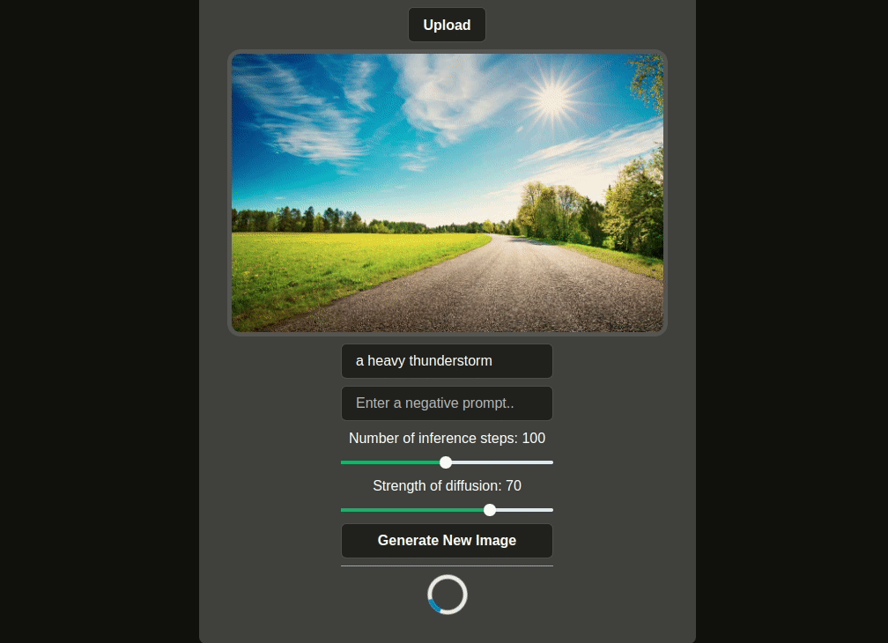

# Stable Diffusion App

A user-friendly, highly customizable Python web app that allows you to run image to image stable diffusion locally on both linux with a built-in GPU and mac machines with or without a built-in GPU.

<div align="center">

</div>


# Getting Started

### 🧬 1. Clone the Repo

```
git clone https://github.com/pynecone-io/pynecone-examples.git
```

### 📦 2. Install Pynecone and dependencies
First create a new virtual environment of your choice, i.e. conda or venv. 

To get started with Pynecone, you'll need:

Python 3.7+
Node.js 12.22.0+ (No JavaScript knowledge required!)
Install Pynecone using pip:

```
pip install pynecone
```

Then if you are running on mac run:
```
pip install -r mac_requirements.txt
```

Or if you are running on linux run:
```
pip install -r linux_requirements.txt
```

### 🚀 3. Run the application
Navigate to the stable_diffusion directory, initialize and run the app:

```
cd stable_diffusion
pc init
pc run
```


# Contributing

We welcome contributions to improve and extend the Stable Diffusion UI. 
If you'd like to contribute, please do the following:
- Fork the repository and make your changes. 
- Once you're ready, submit a pull request for review.


## Testing: 
- So far this has been tested on GPUs of 16GB and larger, but it should work on GPUs down to a size of 6GB. (if you are getting a CUDA out of memory error, try reducing the size of the image). 
- This app should also work on a mac with only a CPU available. If the inference is slow, try reducing the size of the image by changing the width parameter in image_style inside of styles.py, or try reducing the number of inference steps.

## Still to come:
- text-to-image functionality

## License
The following repo is licensed under the MIT License.